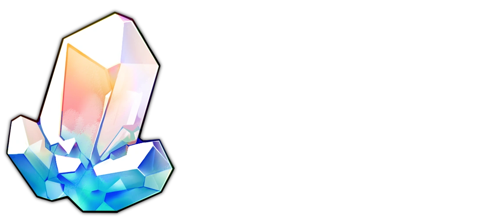
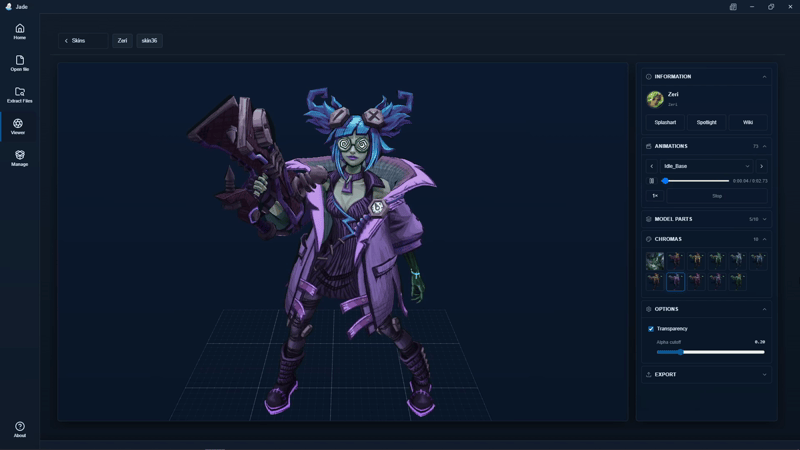
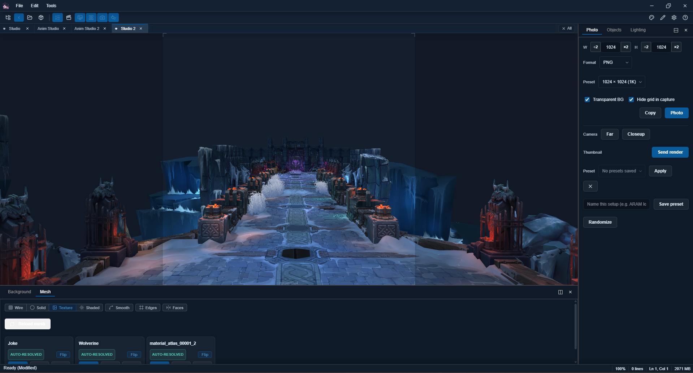
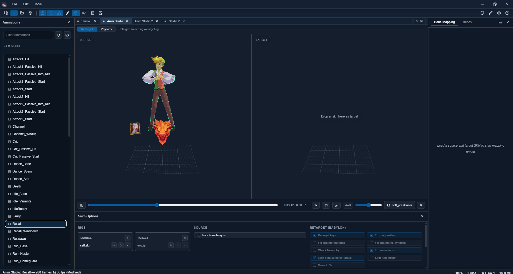
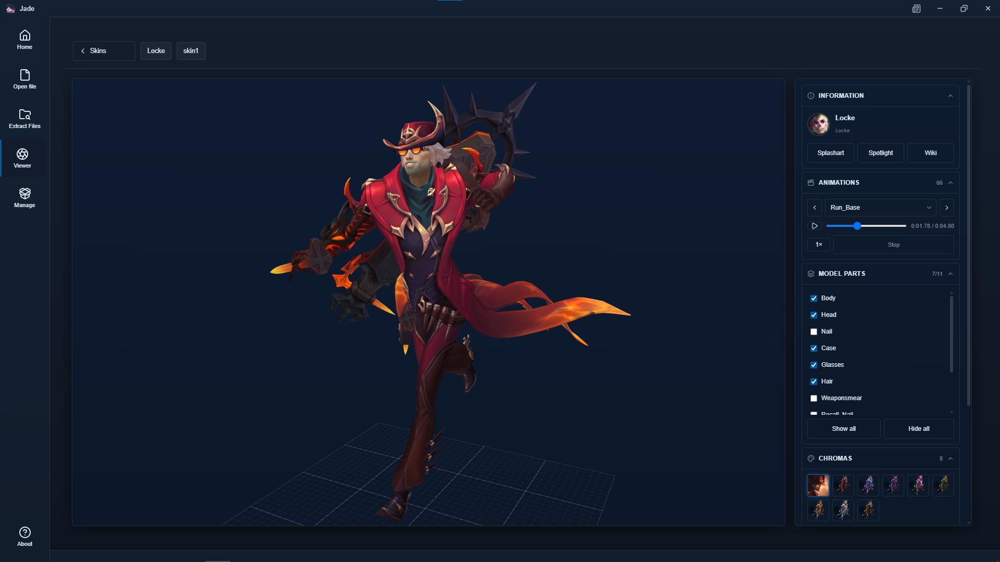
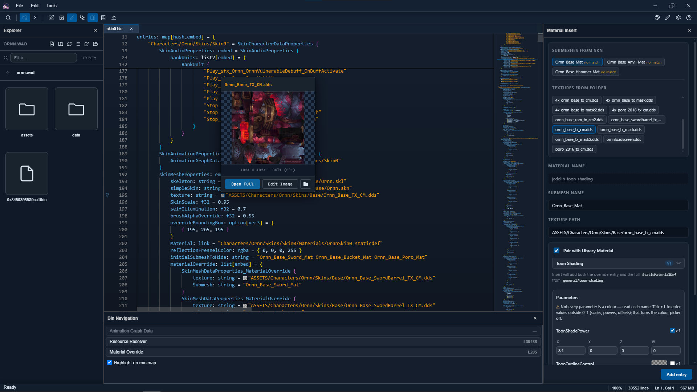
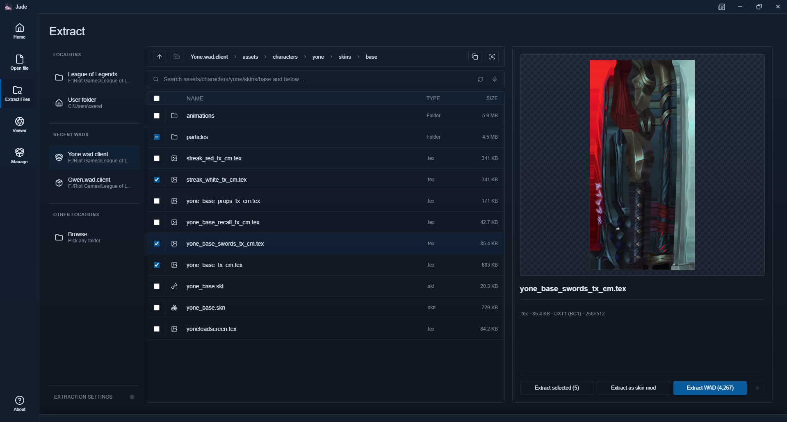

### Jade League Studio

A feature rich studio app designed for modding and editing League of Legends files.

 

---

[Download](#download) · [Features](#features) · [License](#license)

---

## Features

<b>Photo Studio</b> · stage a mod and export a finished thumbnail without opening Blender

 

Load models into a scene, pose them, pick a backdrop, and capture.

- Multiple models per scene, with move, rotate and scale gizmos, and an animations panel to scrub to the exact frame you want.
- Backgrounds: transparent, solid colour, any image, or a real game map.
- Capture at any resolution, with clean transparency so a closeup needs no cutout work, and save or copy straight to clipboard.
- Shots lets you set up several camera and pose configurations and capture them all in one press.
- A Thumbnail tab for arranging captures, text and shapes into a finished mod-post image, then exporting it as a PNG.
- Scenes save and reopen exactly where you left off.

 

<b>Animation Studio</b> · retarget clips onto a different skeleton and bake them back to disk

 

Nobody is re-authoring eighty clips of recall and idle by hand. This takes animations made for one champion and makes them play correctly on another.

- Map the source skeleton onto the target, preview both side by side, and adjust until it looks right. Batch mode runs a whole folder through the same mapping.
- A built-in fetcher pulls the game's own clips for the skin you are modding, so you don't have to hunt for files.
- Physics for hair, capes and the like, with sensible defaults, adjustable collisions, and a viewport mode tuned just for physics work.
- Bakes finished animations back to disk, with automatic backups and a one-click restore if a bake goes wrong.

 

<b>Viewer</b> · browse champions and skins, then look at them properly

 

Pick a champion, pick a skin, and look at the actual model — with chromas, animations, and even full maps.

Materials render the way they do in game, not an approximation, so what you see is what players get.

From there you can toggle parts of the model, swap materials, or jump straight into the bin editor for whatever you are looking at.

 

<b>Bin editing</b> · text, graph, or panels, depending on how you like to work

 

Work on bins the way that suits you:

- **Text** — a full code editor with syntax highlighting and search.
- **Graph** — a node view where files are nodes and references are wires, like Blender's shader editor. Drag a texture onto a mesh and the file is rewritten for you.
- **Panels** — material editor, material library, and a particle editor, for making changes without touching text at all.

Plus a compare tab for diffing two bins, split view, and Quartz integration. It also notices when another tool modifies a file you have open.

 

<b>WADs and extraction</b> · from browsing everything to extracting a skin in three clicks

 

Browse any WAD like a normal folder and preview files before pulling them out, or run batch extraction across several WADs at once.

Quick Extract handles the common case: pick a champion, pick a skin, extract — and optionally drop straight into the viewer afterwards.

File names stay readable and keep themselves up to date automatically, so extractions don't fill up with cryptic hex names.

There is also an asset gallery for working through a mod folder, and a file explorer with proper icons and right-click actions.

 

<b>Mod checker</b> · scan a mod, understand what is wrong, fix the safe things

 

Scans a mod folder or a `.fantome` and reports what it finds by category, each with a risk badge and a preview of what a fix would change — nothing is touched without showing you first.

The wording is deliberately honest: things that get dropped, removed or cropped are labelled as such rather than all being called a repair. If a check doesn't interest you, filter it out.

Some of the newer checks are not fully tested yet. Treat the output as a hint rather than a verdict.

<b>The app itself</b> · make it look and feel exactly how you want

 

Almost everything about how Jade looks and works is yours to change.

- Three completely different layouts to choose from — VS Code, Visual Studio, or a Word-style ribbon. Pick whichever one bothers you least.
- A full set of themes including light and high contrast, classic and modern looks, and an effects tab that gives some themes extra personality.
- Load your own fonts, and even set a custom app icon.
- Docking, floating panes, split views and tab stacking — arrange every panel where you want it, and the app remembers your layout between sessions.

---

## Download

Grab the latest build from the [releases page](https://github.com/RitoShark/Jade-League-Studio/releases), run the installer, and you're done.

> [!NOTE]
> The app needs a League install for some of its features such as the viewer or the materials, but everything else still works.

## Notes

- This project is not affiliated with Riot Games.

## License

[PolyForm Strict 1.0.0](LICENSE.md). Source available, not open source.

You may use Jade League Studio for any noncommercial purpose. You may not redistribute it, and you may not make changes or derivative works based on it. Everything else stays with the copyright holder.

